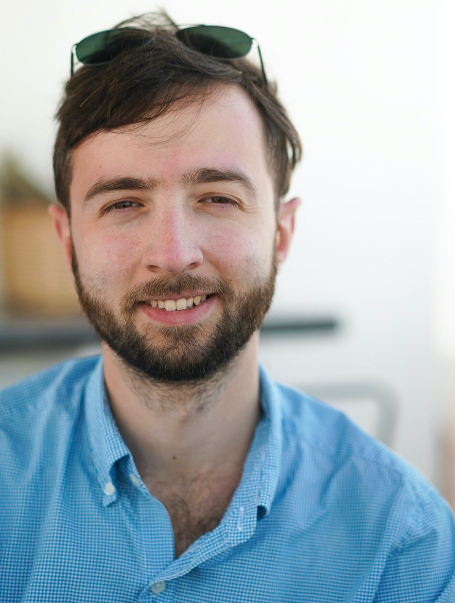

# Hi, I'm Mike!

{width=400px align=center}

I'm a software engineer at [Spectric Labs](https://spectric.com).

I build various scalable and real-time digital signal processing and machine learning-based recommender systems using a variety of tools.

## Education

I graduated from the University of Virginia in 2014 with a Bachelor of Science in Electrical Engineering and a second major in Computer Science and in 2016 with a Master of Engineering in Electrical Engineering on the topic of approximating noise waves in microwave and millimeter devices. I had the pleasure of conducting research under [Bobby Weikle](https://engineering.virginia.edu/faculty/robert-m-weikle-ii). In addition, I researched incorporating genetic algorithms into the multi-objective optimization problem of visual fidelity vs runtime in path tracers with [Wes Weimer](https://web.eecs.umich.edu/~weimerw/).

## Miscellany

Outside of work, I have a passion for photography, food (especially molecular gastronomy), cocktails, and travel. I'm also absolutely in love with my dog (and primary photography subject), [Poppy](https://instagram.com/jalapenopoppy), and my incredible wife, [Erin](https://erin.recachinas.dev).

{width=400px}
